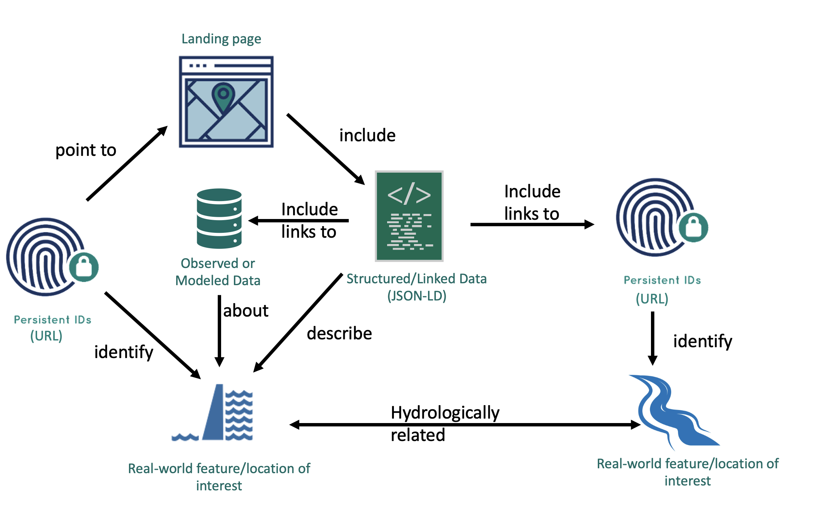

# What is Geoconnex?

The Geoconnex project provides technical infrastructure and guidance for creating an open, community-contribution model for a knowledge graph linking hydrologic features in the United States, published in accordance with [Spatial Data on the Web best practices](https://www.w3.org/TR/sdw-bp/) as an implementation of [Internet of Water](https://github.com/opengeospatial/SELFIE/blob/master/docs/demo/internet_of_water.md) principles.

In short, Geoconnex aims to make water data as easily discoverable, accessible, and usable as possible. 

The Geoconnex knowledge graph is located at [https://graph.geoconnex.us](https://graph.geoconnex.us) and its value can be illustrated considering two use cases:

1. Indexing and discovering models and research from public sector, private sector, or academic projects about a particular place or environmental feature.  
2. Building a federated multi-organization monitoring network in which all member-systems reference common monitored features and are discoverable through a community index.

See [https://geoconnex.us/demo](https://geoconnex.us/demo) for a mockup of data discovery and access workflows that `https://geoconnex.us` aspires to enable. 

The development of geoconnex.us takes place on GitHub. See [here](https://github.com/internetofwater/about.geoconnex.us) for the system of repositories.

{/*
<!-- # Introduction

## Basic Information Model 

The model used to organize information in the Geoconnex system is shown in @fig-info-model.

{#fig-info-model}

-   **Data providers** refer to specific systems that publish water-related **datasets** on the web. Many times a provider will simply be the data dissemination arm of an organization, such as the [Reclamation Information Sharing Environment (RISE)](https://data.usbr.gov) of the US Bureau of Reclamation. Some organizations may have multiple data providers, such as US Geological Survey, which administers the [National Water Information System](https://waterdata.usgs.gov) as well as the [National Groundwater Monitoring Network](https://cida.usgs.gov/ngwmn/), among others. Some data providers are aggregators of other organizations' data, such as the [Hydrologic Information System](https://data.cuahsi.org) of CUAHSI.

-   **Datasets** refer to specific collections of data that are published by data providers. In the context of Geoconnex, a single dataset generally refers to one that is collected from, or summarizable to, a specific spatial **location** on earth, as part of a specific activity. For example, a dataset would be the stage, discharge and water quality sensor data coming from a single stream gage, but not the collection of all stream gage readings from all stream gages operated by a given organization. A dataset could also be the time-series of a statistical summary of water use at the county level.

-   **Locations** are specific locations on earth that datasets are collected from or about, such as stream gages, groundwater wells, and dams. In the case of data that is reported at a summary unit such as a state, county, or hydrologic unit code (HUC), these can also be considered Locations. Conceptually, multiple datasets from multiple providers can be about the same Location, as might occur when a USGS streamgage and a state DEQ water quality sampling site are both located at a specific bridge.

-   **Hydrologic features** are elements of the water system that are related to locations. For example, a point may be on a river, which is within a watershed, and whose flow influences an aquifer. Each of these are distinct, identifiable features which many Locations are hydrologically related to, and which a user of a given dataset might also want to use.

-   **Cataloging features** are areas on earth that commonly group datasets. They are a superset of summary features such as HUCs, counties and states. For example, a state-level dataset summarizing average annual surface water availability would not have states as a cataloging feature. However, streamgage is within a state, county, HUC, congressional district, etc and may be tagged with these features in metadata, and thus be filtered alongside other streamgages within the same state.

This Geoconnex guidance concerns how to explicitly publish metadata that describes Datasets how they are related to each of the other elements of the information model. -->
*/}